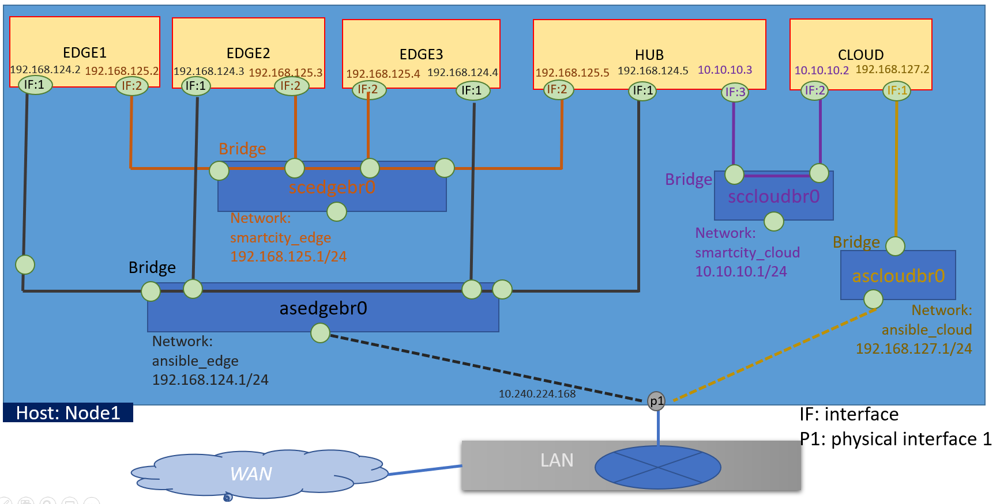
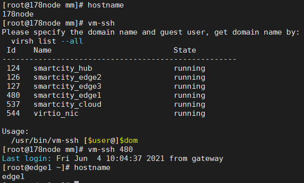

# kvm-script
tools to management KVM

## configure your network in global.vars

```
cat global.vars
vim global.vars
```


## Generate a mac pool for host interfaces

```
./cmd/generate_mac_pool.sh

declare -A MACS=([host1]="" [host2]="" [hostn]="")
./cmd/generate_mac_pool.sh
```

## Generate network xml snippet files and create network

```
./cmd/generate_network_xmls.sh

./cmd/generate_network_xmls.sh NET_NAMES NET_MACS
ls /tmp/vir_network
virsh net-create /tmp/vir_network
virsh net-list

```
delete a network by: `virsh net-destroy`

## Generate domain xml snippet files and create vm
please prepare a image for VM firstly follow these guide:
- [Quickly Build Virtual Machine Images With Virt-builder](#https://ostechnix.com/quickly-build-virtual-machine-images-with-virt-builder/)
- [Virt-builder and virt-install](#https://developer.fedoraproject.org/tools/virt-builder/about.html)

```
./cmd/generate_domain_xml.sh

export HOST=cloud
export BASEIMG=/var/lib/libvirt/images/$HOST.qcow2

export VM_NAME=smartcity_$HOST
export VM_MEMSIZE_G=10
export VM_VCPUS=6

./cmd/generate_domain_xml.sh NET_MACS $HOST NET_NAMES
virsh create /tmp/vir_domain/$VM_NAME.xml
virsh list
```
You can also install a vm by: 
[15 virt-install examples | KVM virtualization commands cheatsheet](#https://www.golinuxcloud.com/virt-install-examples-kvm-virt-commands-linux/)


## inject interface script to disable dhcp

```
./cmd/inject_tail_ifcs_script.sh
./cmd/inject_tail_ifcs_script.sh $dom
```

## set hostname for domain
```
./cmd/set_hostname.sh
./cmd/set_hostname.sh $dom $hostname
```

## inject ssh key into domain
```
./cmd/inject_ssh_key.sh
./cmd/inject_ssh_key.sh $dom $user $key_file
```

## resize volume for a domain
```
./cmd/resize_volume.sh
./cmd/resize_volume.sh $dom $size $disk $volume
```

## attach a disk to a domain
```
./cmd/attach_disk.sh
./cmd/attach_disk.sh $dom $size
```

## Resize volume in guest
This command is used for extend lvm in an activity guest.
Please check your guest OS support hot plugin.
```
# grep "CONFIG_HOTPLUG_PCI_ACPI=" /boot/config-`uname -r`
CONFIG_HOTPLUG_PCI=y

# grep "CONFIG_HOTPLUG_PCI=" /boot/config-`uname -r`
CONFIG_HOTPLUG_PCI_ACPI=y

# grep "CONFIG_MEMORY_HOTPLUG=" /boot/config-`uname -r`
CONFIG_MEMORY_HOTPLUG=y
```
run these commands in host:
```

```
you can also run these commands in guest:
```
GUSER=root
host=
scp ./src/vm/script/create_lvm.sh $GUSER@$host:~/
ssh $GUSER@$host
./create_lvm.sh $dev $lv_path
```

## run command or script in guest 
```
./cmd/run_in_vm.sh
echo "cat /etc/hostname" >> guest_host.sh
chmod a+x guest_host.sh
./cmd/run_in_vm.sh $dom - ./guest_host.sh
./cmd/run_in_vm.sh $dom lsblk
```

## login guest by ssh
```
cp ./cmd/ssh_vm.sh /usr/bin/ssh-vm
ssh-vm
```


# enhancement
## leverage yp to pareser xml
```
# https://www.cloudsavvyit.com/1889/how-to-convert-xml-to-json-on-the-command-line/
# https://stackoverflow.com/questions/61666898/convert-xml-to-json-using-command-line-or-using-shell-script
# https://www.endpoint.com/blog/2019/12/31/making-sense-of-xml-json-in-shell
# https://unix.stackexchange.com/questions/504880/script-to-translate-xml-to-json
# http://manpages.ubuntu.com/manpages/bionic/man1/xml2json.1p.html
# https://codefaster.substack.com/p/mastering-jq-xml-and-any-other-data
# https://www.hellocodeclub.com/how-to-convert-xml-to-json-in-python-ultimate-guide/
# https://linuxhint.com/python_xml_to_json/
https_proxy=http://comany.com:xxx  pip3 install yq

cat | xq .  << EOF
<e>
  <a>some</a>
  <b>textual</b>
  <a>content</a>
</e>
EOF

cat | xq -x << EOF
{
  "e": {
    "a": [
      "some",
      "content"
    ],
    "b": "textual"
  }
}
EOF
```

# REF:
- [install window guest with virtio drivers](#https://opennodecloud.com/opennode-os/2013/01/01/howto-kvm-guest-install.html)
